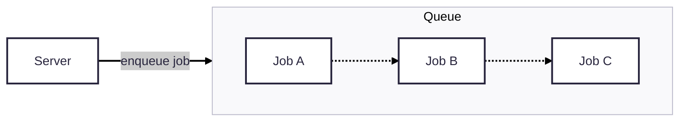
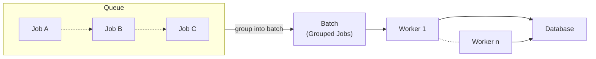
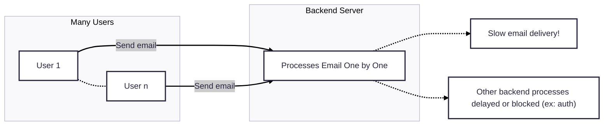
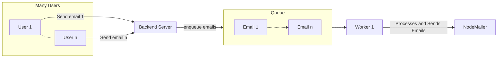

# BuildIT
- **Theme : Background jobs, queues, and batch processing**

## Introduction :
### Background Jobs :
Background jobs are tasks that run asynchronously, independent of the server process. They are used for tasks that aren't time sensitive and for optimisation purposes. 

### Queues :
Queues are a data structures used to store jobs. It's a way to give "order" for these jobs, typically it's done first in first out. The first job that goes in is the first to be executed, while the last ones must wait. It's a good method to structure multiple processes, keeping them structured. 

### Batch Processing :
Instead of processing task one at a time, batch processing groups them into "batches" to be executed at the same time. This can heavily optimise high volume operations, for example if too many jobs are overflowing the queue, grouping them into batches will make things faster.

### Worker :
It's a process with responsibility to pull background jobs from a queue, and executes them.

## Project :
We built a marketing platform that provides email services to companies. The companies come to the platform and request their marketing email to be sent or scheduled to hundreds of users, the website takes charges of this task while also providing the companies useful analytics such as how many users received the email. 

## Problem :
Say if hundreds of users are using the site, and all of them send their email at once.
The backend will process them one by one which not only takes a long time, but also delays other processes such as user authentication. This can induce a deadlock at some point.

## Solution : 
A solution to this is defining a background job, which consists of the server taking
each email and pushing them into a queue. The worker is tasked with pulling jobs from the queue and processing them. 
Seperating emails into background jobs give concurency for the backend, which allows it the to also process other tasks seperate from emails. Resolving the above problem.

## Tech stack:
### Backend :
- NodeJS
- ExpressJS
- MariaDB
- Redis + BullMQ
### Frontend :
- React 
